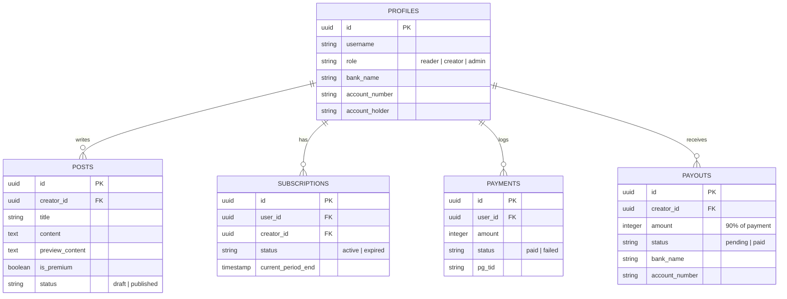

# 프로젝트 개발 산출물 인계서 (Handover Document)

* **프로젝트명**: 지식 콘텐츠 기반 구독 서비스 플랫폼 (**InsightBridge**)
* **개발 단위**: 최소 기능 제품 (MVP - Minimum Viable Product)
* **산출물 인계일**: 2026년 6월 18일
* **원격 저장소**: [https://github.com/geumsagwa/sub-service](https://github.com/geumsagwa/sub-service)
* **인계인**: Antigravity (AI Coding Assistant)
* **인수인**: geumsagwa (서비스 기획 및 소유자)

---

## 1. 서비스 정의 및 핵심 가치
**InsightBridge**는 실무 지식을 보유한 크리에이터가 프리미엄 콘텐츠를 생산하고, 독자가 이를 구독하여 학습하며 플랫폼 관리자가 중간 재무 및 정산을 통제하는 **지식 비즈니스 원스톱 솔루션**입니다.

### 💡 핵심 가치 사슬 (Value Chain)
```
[독자: 지식 탐색/구독] ➔ [작가: 아티클 발행/계좌등록] ➔ [관리자: 결제/수수료 집계 및 송금 실행]
```

---

## 2. 기술 스택 및 실행 환경

| 구분 | 사양 | 상세 |
| :--- | :--- | :--- |
| **기반 프레임워크** | **Next.js 16.2.9 (App Router)** | TypeScript 적용, SSR/CSR 하이브리드 최적화 |
| **디자인 & 스타일** | **Tailwind CSS v4 / Custom CSS** | Outfit & Playfair Display 웹폰트 바인딩, 리딩용 글래스모피즘 UI |
| **DB & Auth (설계)** | **Supabase (PostgreSQL)** | RLS(Row Level Security) 설계 완료 및 목업 연동 |
| **상태 관리** | **React Context** | 로컬스토리지 연동을 통한 브라우저 새로고침 시 데이터 보존 |

---

## 3. 주요 인계 파일 구조 및 링크

인수자는 아래 경로를 통해 핵심 코드 파일에 즉시 접근하여 분석할 수 있습니다.

```
sub-service/
├── supabase_schema.sql          # PostgreSQL DDL 스키마 설계도
├── package.json                 # 의존성 패키지 및 개발 실행 스크립트 정의
├── src/
│   ├── app/
│   │   ├── layout.tsx           # SEO 메타 태그 최적화 및 AppProvider 바인딩
│   │   ├── page.tsx             # 전체 메인 뷰 (피드, 디테일 뷰어, 에디터, 서재)
│   │   └── globals.css          # 에디토리얼 타이포그래피 및 애니메이션 토큰
│   ├── context/
│   │   └── AppContext.tsx       # 글로벌 상태 관리 (인증, 정산, 결제 이력 총괄)
│   └── components/
│       ├── Navbar.tsx           # 독자 / 작가 / 관리자 3단 역할 전환 헤더바
│       ├── PaymentModal.tsx     # 토스페이먼츠 간편결제 승인 시뮬레이터 모달
│       └── MockPanel.tsx        # 우하단 체험 가이드 및 로컬 데이터 리셋 패널
```

* **테이블 설계도 스크립트**: [supabase_schema.sql](file:///c:/Users/pass6/project/sub-service/supabase_schema.sql)
* **글로벌 상태 저장소**: [AppContext.tsx](file:///c:/Users/pass6/project/sub-service/src/context/AppContext.tsx)
* **메인 컨트롤러 페이지**: [page.tsx](file:///c:/Users/pass6/project/sub-service/src/app/page.tsx)
* **디자인 토큰 스타일**: [globals.css](file:///c:/Users/pass6/project/sub-service/src/app/globals.css)

---

## 4. 핵심 구현 기능 명세

### 4.1. 독자(Reader) 시나리오
* **콘텐츠 탐색 및 필터링**: 카테고리별(개발, 디자인, 마케팅, 비즈니스) 실시간 포스트 필터링 기능.
* **프리미엄 페이월(Paywall)**: 
  * 무료 아티클은 제한 없이 전체 열람이 가능합니다.
  * 유료 아티클은 요약 미리보기(Preview) 텍스트만 렌더링되며 아래 영역이 자연스럽게 페이드아웃 처리됩니다. 동시에 유료 멤버십 가입 유도 배너가 활성화됩니다.
* **Toss Payments 결제**: '구독하기' 버튼 클릭 시 간편 결제창 모달이 노출됩니다. 결제수단 선택 후 승인을 완료하면 스피너 로딩 연동 후 성공 확인 알림이 나타나며, 본문 페이월이 실시간으로 부드럽게 해제됩니다.

### 4.2. 크리에이터(Creator) 시나리오
* **정산 계좌 등록 ([page.tsx:L551-655](file:///c:/Users/pass6/project/sub-service/src/app/page.tsx#L551-L655))**:
  * 은행명, 계좌번호, 예금주 정보를 입력하여 정산용 계좌를 인증 처리합니다.
  * 등록이 완료되면 대시보드에 `인증완료` 상태가 즉시 갱신됩니다.
* **글쓰기 제한 경보**: 정산 계좌가 비어 있을 경우, **[스튜디오 (글쓰기)]** 상단에 정산 계좌 연동을 촉구하는 주황색 경고 배너가 나타납니다.
* **아티클 실시간 발행**: 제목, 본문, 요약글을 마크다운 문법 규격에 맞춰 작성하여 '발행' 버튼을 누르면 DB(Simulated State)에 실시간 적재되며 메인 피드에 노출됩니다.

### 4.3. 플랫폼 관리자(Admin) 시나리오
* **재무 및 정산 관리 센터 ([page.tsx:L463-549](file:///c:/Users/pass6/project/sub-service/src/app/page.tsx#L463-L549))**:
  * **누적 거래액(GMV)**, **플랫폼 수수료(10%)**, **정산 대기액(90%)**, **정산 완료액**을 한눈에 대조하는 지표 카드들을 제공합니다.
* **펌뱅킹(Firm Banking) 송금**:
  * 독자가 결제할 때마다 자동으로 작가 몫의 정산 대기 상태(`pending`) 내역이 생성됩니다.
  * 관리자가 '송금 실행'을 누르면 은행 통신 연동 시뮬레이션이 작동한 뒤 송금 완료 상태(`paid`)로 갱신되고 재무 지표가 실시간으로 이전 반영됩니다.

---

## 5. 데이터베이스 ERD 구조 요약

데이터베이스 스키마는 5개의 핵심 릴레이션으로 구성되어 있으며, 상호 외래키(FK) 관계로 정합성을 유지합니다.



---

## 6. 인수자 로컬 구동 및 검증 가이드

로컬 환경에 소스코드를 클론하여 즉시 테스트를 시작할 수 있습니다.

### Step 1. 저장소 클론 및 폴더 이동
```powershell
git clone https://github.com/geumsagwa/sub-service.git
cd sub-service
```

### Step 2. 의존성 패키지 설치
```powershell
npm install
```

### Step 3. 개발 서버 실행 및 브라우저 테스트
```powershell
npm run dev
```
* **접속 경로**: `http://localhost:3000`

---

## 7. 향후 제품 고도화 개발 가이드

인수자가 실제 프로덕션 런칭을 준비할 때 점진적으로 구현해야 할 핵심 과제입니다.

1. **실제 Supabase Client SDK 마이그레이션**:
   * 현재 `AppContext.tsx` 내에 정의된 상태(State) 및 `saveToStorage` 함수를 `@supabase/supabase-js` 클라이언트로 교체합니다.
   * `select()`, `insert()`, `update()` 쿼리를 적용하여 실제 데이터베이스 트랜잭션을 구현합니다.
2. **실제 결제창(PG) 도입**:
   * `PaymentModal.tsx`에 포트원(Portone) 또는 토스페이먼츠 SDK의 `requestPayment` API를 주입합니다.
   * 결제 완료 후 플랫폼 백엔드에서 **결제 금액 위변조 검증(Web Hook) 로직**을 반드시 추가해야 합니다.
3. **크리에이터 에디터 고도화**:
   * 현재의 textarea 입력을 Rich Text 에디터(Tiptap, EditorJS, Quill 등)로 전환하여 마크다운 파싱을 자동화하고, 이미지 파일의 CDN 업로드 흐름을 개발합니다.
